# Oberth Efficiency Atlas

**How much of the impulsive Oberth bonus does a real engine keep?**
A simulation, theory and data atlas for finite-burn powered flybys.

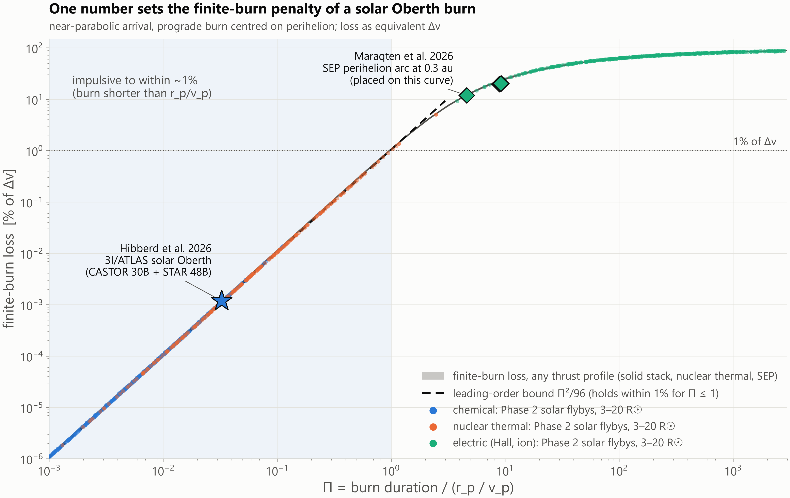

*I plot the finite-burn loss of a prograde solar Oberth burn against the single parameter
Π = t_b / (r_p / v_p). Dots are simulated solar flybys with chemical, nuclear thermal and electric
engines. The star is the 3I/ATLAS burn of Hibberd et al.<sup>1</sup> The diamonds place the
solar-electric arc of Maraqten et al.<sup>6</sup> on the curve, using their own thrust model. Every
thrust profile lands on one curve. Below Π ≈ 1 the impulsive approximation holds to about 1%; above
it the loss grows quickly.*

When a spacecraft fires its engine near periapsis, the Oberth effect makes each m/s of Δv worth far
more than it would be in deep space. Mission design usually treats that burn as *instantaneous*.
Real burns last minutes (chemical), hours (nuclear thermal) or weeks to months (electric), and the
spacecraft keeps moving, and gravity keeps turning its velocity, while the engine runs. This project
measures how much of the impulsive bonus survives, **η = B_finite / B_imp**, across six bodies (Sun,
Venus, Earth, Mars, Jupiter, Saturn) and five engine classes. It also tests whether one
dimensionless number, **Π = t_b / τ** (burn duration over the time to move one periapsis radius),
collapses the results onto a single curve.

It contains:
- a high-precision finite-burn flyby simulator (Python);
- a 135,720-run dimensionless sweep and a 15,360-run mission sample;
- closed-form theory for the small-Π loss, the large-Π regimes and the optimal burn timing;
- a burn-optimization campaign (450 optimizations);
- a re-analysis of the proposed solar Oberth burn of Hibberd et al.<sup>1</sup> as a finite burn;
- an interactive explorer, an animation, and a one-command rebuild of every output.

## Contents

1. [The question](#the-question)
2. [Key results](#key-results)
3. [How it works](#how-it-works)
4. [Results, figure by figure](#results-figure-by-figure)
5. [Data](#data)
6. [Getting started](#getting-started)
7. [Reproducibility and validation](#reproducibility-and-validation)
8. [Repository layout](#repository-layout)
9. [Limitations](#limitations)
10. [Status of the claims and prior work](#status-of-the-claims-and-prior-work)
11. [Documentation](#documentation)
12. [References](#references)

---

## The question

A flyby of a body with gravitational parameter μ, arriving with hyperbolic excess speed v∞ and
passing periapsis at radius r_p, moves fastest at periapsis. A burn there raises the outgoing
excess speed by more than the same Δv would in deep space. The extra amount is the **Oberth
bonus**. An impulsive burn gets all of it. A finite burn spreads the same Δv over a stretch of the
orbit where the spacecraft is slower and farther from the planet, so it gets less.

| symbol | meaning |
|---|---|
| v∞ | arrival hyperbolic excess speed |
| r_p, v_p = √(v∞² + 2μ/r_p) | periapsis radius and speed of the unperturbed flyby |
| τ = r_p / v_p | periapsis timescale: the time to travel one r_p at periapsis speed |
| Δv, c = Isp·g₀, a₀ = T/m₀ | the burn: ideal Δv, exhaust velocity, initial thrust acceleration |
| t_b = (c/a₀)(1 − e^(−Δv/c)) | burn duration |
| **Π = t_b / τ** | **burn parameter** |
| B = v∞,out − (v∞,in + Δv) | Oberth bonus: gain over the same burn in deep space |
| **η = B_finite / B_imp** | **Oberth efficiency.** It is never clipped: η > 1 and η < 0 are real results |
| loss = v∞,imp − v∞,out | equivalent-Δv loss. It is used for bound arrivals, where η is undefined |

η = 1 is an impulsive burn. η = 0 is a burn that gains nothing over deep space. η < 0 is worse than
deep space.

The two questions are:
1. **How much of the bonus does a given engine keep?** This is η as a function of body, flyby and
   engine.
2. **Is Π the right organizing variable?** Do η, or the loss, depend on the burn mainly through Π?

## Key results

All numbers below come from the committed outputs. Each row links to the figure or file that holds
it.

| question | answer | where |
|---|---|---|
| When is a burn impulsive? | When Π ≲ 1, i.e. the burn is shorter than r_p / v_p. For a prograde burn centred on periapsis with Δv ≪ v_p, loss/Δv ≲ Π²/96, which is about 1% at Π = 1. The 1/96 is k(1−k)/24 at its maximum, k = ½ (parabolic arrival). | [hero](figures/hero_loss_vs_pi.png), [rule check](figures/rule_check.png) |
| What does η look like over all Π? | 1 − η = CΠ² at small Π. Then a (9/(2Π))^(1/3) decay while the burn stays on the near-parabolic core. Then a ln Π / Π tail. The energy efficiency η_W falls to ½ at Π½ ≈ 8–40 across the whole sweep. | [regimes](figures/regimes.png), [η vs Π](figures/eta_vs_pi_all.png) |
| Does Π collapse the data? | At small Π, Π√C collapses all 15,375 prograde points to 0.001 dex of scatter in log₁₀(1−η), against 0.285 dex for Π alone. Beyond that, v∞/v_esc is the main secondary parameter: it explains 73–92% of the scatter left within each Π range (prograde). | [collapse](figures/collapse_small_pi.png), [secondary](figures/collapse_secondary.png) |
| How much do real engines keep? | Chemical engines: η ≳ 0.98 even at the 10th percentile, at all six bodies. Nuclear thermal: median η 0.96–0.97 at Venus, Earth and Mars (10th percentile 0.62–0.70), about 1 at the Sun and the giants. Electric engines: median η 0.08–0.42 where the planet-centred model applies. | [mission table](#mission-samples-where-real-engines-sit) |
| Can smarter steering or timing win it back? | Not for realistic engines. The median recoverable gain from optimal burn timing is 7e-6 pp (chemical), 8e-5 pp (nuclear thermal) and 0.0068 pp (electric); the maxima are 0.083, 4.1 and 1.2 pp. A richer pitch law adds at most 0.07 pp. | [phase 3](figures/phase3_missions.png) |
| Does the impulsive model hold for a solar Oberth burn? | Yes for the Hibberd et al.<sup>1</sup> burn: it loses 0.099 m/s of its 8.36 km/s. The loss reaches 1% of Δv at Π ≈ 0.98, which for their stack means thrust 30 times lower. | [phase 4](figures/phase4_reference.png) |
| Does fixed-direction thrust do as well as prograde? | No. For long burns it pulls periapsis down, even into the planet, and η goes negative (down to −24 in the sweep). | [η vs Π](figures/eta_vs_pi_all.png), [atlas](figures/atlas_eta.png) |
| Does oblateness matter? | At the 10 cases tested, J2 changes η by at most 0.0026. | [j2_numbers.json](figures/j2_numbers.json) |

pp means percentage points of η.

## How it works

### The model

- **Dynamics.** Planet-centred two-body problem with point-mass gravity. The spacecraft has one
  constant-thrust, constant-Isp engine, so its mass falls by the rocket equation and its thrust
  acceleration rises during the burn. Absolute mass cancels out of every result.
- **Frame and time.** The frame is the perifocal frame of the *incoming* hyperbola. x̂ points to
  the unperturbed periapsis, ẑ is along the orbital angular momentum and ŷ is the unperturbed
  periapsis velocity direction. Time zero is the unperturbed periapsis passage. The burn midpoint
  is set relative to it (default 0, a burn centred in time). Scalar results are invariant under a
  rotation of the whole problem, and this is tested.
- **Steering laws.**

  | law | thrust direction |
  |---|---|
  | `prograde` | along the instantaneous planet-relative velocity |
  | `inertial` | fixed in space (default: the unperturbed periapsis velocity ŷ) |
  | `pitch_linear` | the velocity direction tilted in the flyby plane by α(s) = α₀ + α₁s, with burn phase s ∈ [−½, ½]; α > 0 tilts toward the planet |
  | `pitch_piecewise` | the same tilt, piecewise linear through given knots |

- **Nondimensional core.** Inside the integrator lengths are in r_p, velocities in √(μ/r_p) and
  times in √(r_p³/μ), so μ = 1, r_p = 1 and m(t₀) = 1. A run is then fixed by four groups:
  ṽ∞, Δṽ, c̃ and ã₀ (plus steering and timing). `simulate_nd` knows no body. A body enters only
  through scale factors and the impact radius and sphere-of-influence flags, so one sweep covers
  every planet. `simulate_flyby` is the SI wrapper for a real body.
- **Bodies and constants.** Sun, Venus, Earth, Mars, Jupiter and Saturn. GM, radii and
  semi-major axes live only in `src/oberth_atlas/constants.py`, each with a source comment (JPL
  SSD, DE440<sup>10</sup>).
- **Numerics.** DOP853 at rtol = atol = 1e-12, split into coast, burn and coast segments so no
  step crosses a thrust discontinuity. The state carries the specific work W = ∫(T/m) û·v dt, so
  the energy-balance residual ε(r,v) − ε₀ − W is a per-run error estimate on every segment.
  Runs are flagged for impact, capture, a floor hit, a sphere-of-influence violation and an
  unreliable η.

### Worked example

[`configs/earth_hydrolox.yaml`](configs/earth_hydrolox.yaml) is a 1 km/s hydrolox burn (Isp 465 s,
a₀ = 2 m/s²) centred on periapsis at 300 km altitude over Earth, arriving at v∞ = 3 km/s. Running
it with `oberth run configs/earth_hydrolox.yaml` writes `runs/earth_hydrolox/result.json`.

| quantity | value |
|---|---|
| periapsis speed v_p, timescale τ | 11.33 km/s, 589 s |
| burn duration t_b | 449 s |
| **Π** | **0.762** |
| impulsive bonus B_imp, finite bonus B_finite | 1714.9 m/s, 1700.7 m/s |
| **η** | **0.9917** |
| equivalent-Δv loss | 14.2 m/s |
| error estimate on η | 1.2e-11 |

The same Δv from a Hall thruster at Jupiter ([`configs/jupiter_hall.yaml`](configs/jupiter_hall.yaml):
a₀ = 3e-4 m/s², Isp 1800 s, v∞ = 5.5 km/s) takes 37.5 days (Π = 2350) and keeps η = 0.089.

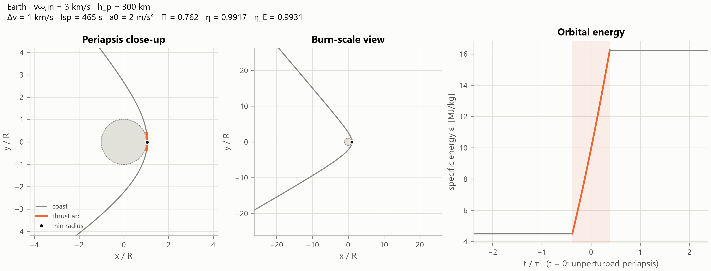

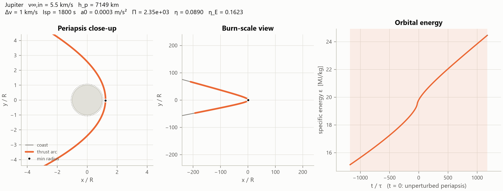

*I simulate two flybys with `oberth run`. The left and middle panels show the trajectory at the
periapsis scale and at the burn scale, with the thrust arc in orange and the coast in grey. The right
panel shows the specific orbital energy against t/τ, with the burn shaded.*

**How to read them.** In the Earth case the 449-s burn covers a short arc around periapsis, and the
energy rises in a steep ramp where gravity is strongest. In the Jupiter case the burn spans about
200 planetary radii on each side. The energy rises almost linearly in time, with only a small
kink at periapsis, because the engine does most of its work far from the planet where there is
little Oberth bonus to collect.

### How the pieces fit

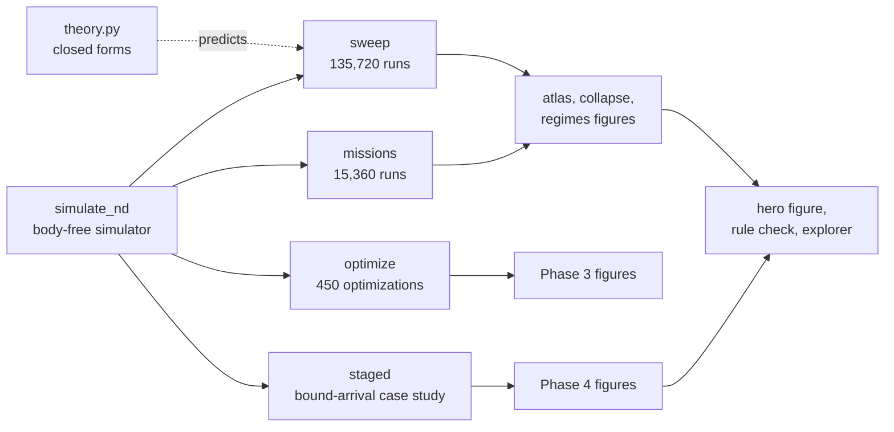
```mermaid
flowchart LR
    SIM["simulate_nd<br/>body-free simulator"]
    THEORY["theory.py<br/>closed forms"]
    SIM --> SWEEP["sweep<br/>135,720 runs"]
    SIM --> MISS["missions<br/>15,360 runs"]
    SIM --> OPT["optimize<br/>450 optimizations"]
    SIM --> STAGED["staged<br/>bound-arrival case study"]
    THEORY -. "predicts" .-> SWEEP
    SWEEP --> ATLAS["atlas, collapse,<br/>regimes figures"]
    MISS --> ATLAS
    OPT --> P3["Phase 3 figures"]
    STAGED --> P4["Phase 4 figures"]
    ATLAS --> HERO["hero figure,<br/>rule check, explorer"]
    P4 --> HERO
```

### Theory in brief

The derivations are in [`docs/theory.md`](docs/theory.md) and are implemented in
`src/oberth_atlas/theory.py`. Units are nondimensional there (μ = r_p = 1), k = 1/v_p², and
ξ = 2Δv(v_p − v∞)/(v∞ + Δv)².

```
exact map     η = (√(1 + ξ·η_W) − 1) / (√(1 + ξ) − 1)       η_W: energy-based efficiency
small Π       1 − η = C·Π²,   C = (D/Π²) / (v∞,imp · B_imp),  D = W_imp − W (work deficit)
              prograde, constant a, centred:  D/Π² = (k/24)·Δv·[(1−k)·v_p + (1+k)·Δv]
              inertial,  constant a, centred:  D/Π² = (k/24)·Δv·(v_p + Δv)
1 ≪ Π ≪ Π_T  η_W ≈ (9/(2Π))^(1/3) ≈ 1.65·Π^(−1/3)          near-parabolic core
Π ≫ Π_T       η_W ~ ln Π / Π                                  hyperbolic tail
Π_T = v_p·V²/v∞³                                              hyperbola crossing time / τ
```

- **Energy bookkeeping.** Along any burn, dε/dt = a û·v, so the energy gained is the work W. The
  baseline-subtracted **η_W** = (W − W_deep)/(W_imp − W_deep) is linear in thrust. The speed-based
  η is an exact function of η_W and ξ, so the two carry the same information. A third metric, η_E
  (energy gained over energy gained impulsively), is deprecated: it has a nonzero deep-space floor.
  It is stored for continuity only.
- **Linear response.** For Δv → 0 at fixed Π, η_W tends to η_lin(Π; v∞/v_esc), one universal curve
  per arrival speed, computed by quadrature in the hyperbolic anomaly.
- **Small-Π expansion.** For a burn near an apse, the loss to leading order is a sum of three
  pieces: gravity turning the velocity, the speed-dependent turn rate during the burn, and (for
  fixed-direction thrust) the sideways thrust component. The thrust profile enters only through its
  moments, so mass ratio and burn timing are handled exactly.
- **Where Robbins fits.** The leading-order scaling kΠ²Δv/24 is due to Robbins<sup>2</sup>, as quoted
  by Confraria<sup>4</sup> (the original was not accessible). For fixed-direction thrust it equals
  the leading-order loss derived here (claim P1). Prograde thrust comes in below it. See
  [Status of the claims](#status-of-the-claims-and-prior-work).
- **Optimal timing.** The prograde loss depends on burn placement only through
  m₂ = σ² + (x̄ − x_c)², so the optimum puts the centroid of the Δv distribution, not the time
  midpoint, at periapsis. The recovered share of the deficit follows in closed form.

## Results, figure by figure

Every figure is a 300-dpi PNG made by one script in [`scripts/`](scripts/), with the script path
and git commit embedded in the PNG metadata. The numbers quoted for each figure are in the matching
`figures/*_numbers.json` or CSV. Each figure has a short caption, then notes on how to read it and
what it shows.

### Single flybys (Phase 1)

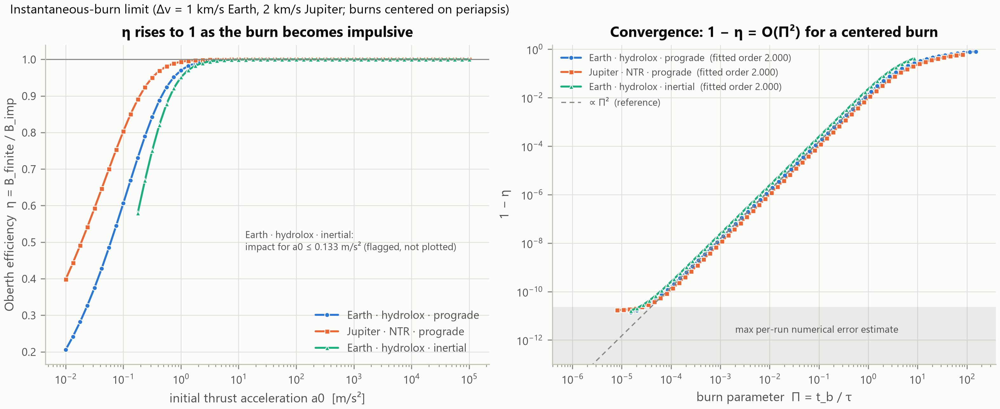

*I raise the thrust acceleration a₀ at fixed Δv and plot η (left) and 1 − η against Π (right). The
cases are an Earth hydrolox burn (Δv = 1 km/s), a Jupiter nuclear-thermal burn (Δv = 2 km/s) and the
Earth burn with fixed-direction thrust. All burns are centred on periapsis.*

- **How to read it.** The right panel is log-log. A straight line of slope 2 means 1 − η ∝ Π². The
  grey band at the bottom is the largest per-run numerical error estimate.
- **What it shows.** η rises to 1 as thrust grows, and the fitted convergence order is 2.000 in all
  three cases, as the small-Π theory predicts. At the bottom of the range, 1 − η reaches the
  numerical floor of a few 1e-11. The fixed-direction Earth burn hits the planet for
  a₀ ≤ 0.133 m/s², so those runs are flagged and not plotted.

### The sweep: where η is 1 and where it is not (Phase 2)

The sweep is a tensor grid over the four nondimensional groups: 15 values of ṽ∞ × 12 of Δṽ × up
to 12 of c̃ × 39 of ã₀, for two steering laws. Pairs with Δv/c > 2 are skipped, which leaves
135,720 runs (67,860 per law). The grid bounds are the extremes of all body and engine
envelopes in [`configs/atlas/presets.yaml`](configs/atlas/presets.yaml), widened by 1.5 on each
side, so every real mission lies strictly inside it. There were no integration errors, and 133,969
rows are reliable; the excluded rows are all inertial (1,617 captured, 134 that reached the floor
radius).

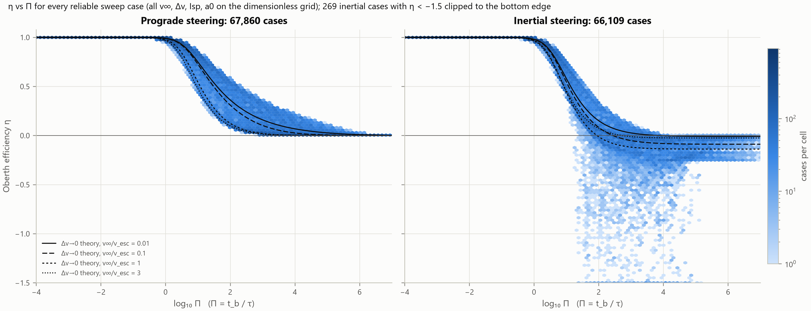

*I plot η against log₁₀ Π for every reliable sweep case, as a hexbin density (prograde on the left,
inertial on the right). The black curves are the Δv → 0 linear-response theory for four arrival
speeds.*

- **How to read it.** Darker cells hold more cases. The spread of cells at one Π comes from
  everything else on the grid: v∞, Δv, mass ratio.
- **What it shows.** All cases sit at η = 1 for Π ≪ 1 and fall as Π passes 1. Prograde η decays
  smoothly toward 0. Inertial η does the same up to Π ≈ 10, then diverges: η < 0 for 33% of the
  inertial cases at Π = 10–10³ and 95% at Π ≥ 10³, reaching −24.4. The fixed-direction burn is not
  just less efficient, it is a different regime, because sideways thrust changes the flyby geometry.

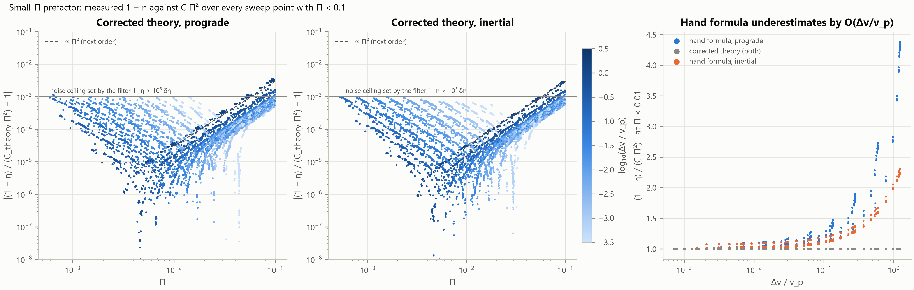

*I test the closed-form small-Π prefactor C against every sweep point with Π < 0.1. The left and
middle panels show the relative deviation of 1 − η from CΠ² (prograde, inertial), coloured by Δv/v_p.
The right panel shows (1 − η)/(CΠ²) at Π < 0.01 against Δv/v_p for the corrected theory and for an
uncorrected estimate that evaluates the losses along the unperturbed trajectory.*

- **How to read it.** In the left and middle panels the deviation should shrink as Π → 0. The
  grey line is a noise ceiling set by the filter 1 − η > 10³·δη. The right panel should sit on 1.
- **What it shows.** The corrected prefactor matches to better than 1.2e-3 for every point with
  Π < 0.01 (prograde) and 1.0e-3 (inertial). The uncorrected estimate underestimates the loss by a
  median of 1.14 (prograde) and 1.05 (inertial), and by up to 4.4 and 2.3, with the error growing as
  Δv/v_p. The remaining deviation in the left panels grows as Π², the next order.

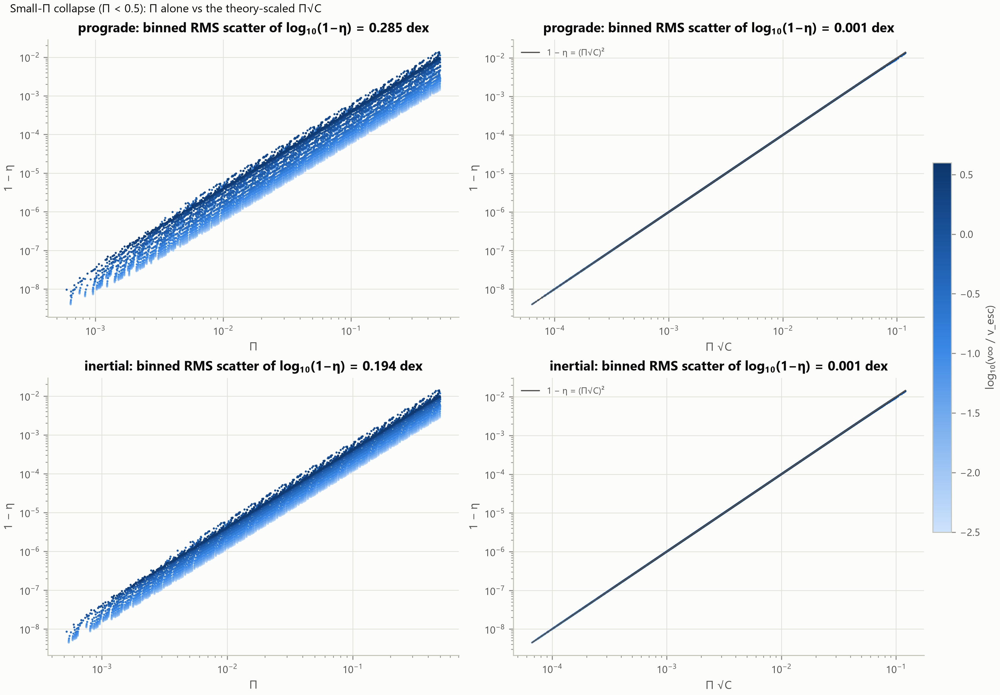

*I plot 1 − η against Π (left) and against Π√C (right) for Π < 0.5, for prograde (top) and inertial
(bottom) steering. Colour is v∞/v_esc.*

- **How to read it.** If a variable collapses the data, the points fall on one line.
- **What it shows.** Against Π alone, the binned RMS scatter of log₁₀(1 − η) is 0.285 dex
  (prograde) and 0.194 dex (inertial). Against Π√C it is 0.001 dex in both: the data lie on
  1 − η = (Π√C)². So Π is the right variable once the arrival speed, Δv and mass ratio are folded
  into C.

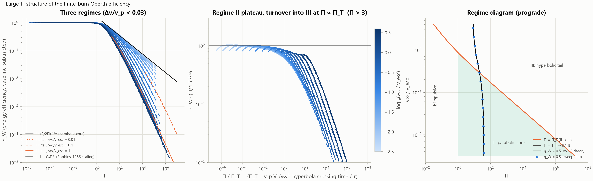

*I show the large-Π structure of the prograde energy efficiency η_W for Δv/v_p < 0.03. The left
panel compares the sweep with the three analytic laws. The middle panel rescales to expose the
parabolic-core plateau. The right panel is the regime diagram in (Π, v∞/v_esc), with the η_W = ½
contour.*

- **How to read it.** In the middle panel, a flat line at 1 means η_W = (9/(2Π))^(1/3). The vertical
  line is Π = Π_T, the hyperbola crossing time over τ. In the right panel the orange line is
  Π = Π_T and the shaded region is where the parabolic-core regime exists.
- **What it shows.**
  - The parabolic-core regime exists only for slow arrivals (v∞ ≪ v_esc).
  - The plateau holds to a median of 0.98 over 3,767 points, and turns over into the hyperbolic
    tail near Π ≈ Π_T.
  - The half-efficiency point Π½, where η_W = ½, ranges from 8.4 to 39.9 over the sweep, with a
    median of 26. The Δv → 0 theory predicts it to 0.4% median error and 7.8% at worst.

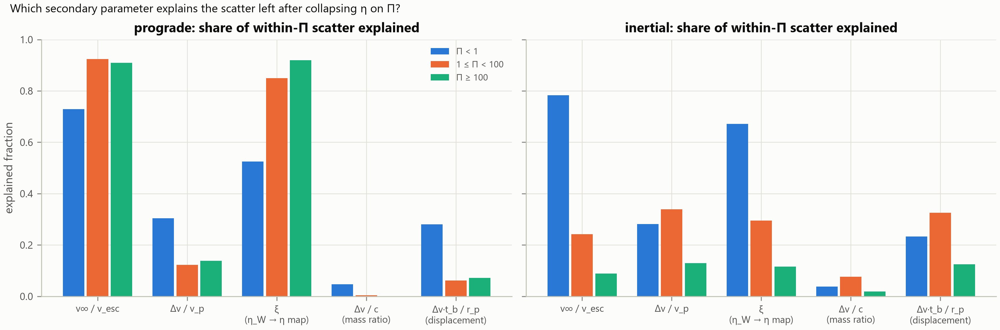

*I measure which secondary parameter explains the scatter in η left after collapsing on Π. Bars show
the share of within-Π scatter explained, in three Π ranges, for prograde (left) and inertial
(right) steering.*

- **What it shows.** For prograde burns v∞/v_esc explains 73% of the scatter at Π < 1, 92% at
  1 ≤ Π < 100 and 91% at Π ≥ 100. The mass-ratio parameter Δv/c explains almost nothing. For
  inertial burns v∞/v_esc explains 78% at Π < 1 but only 24% at 1 ≤ Π < 100, where Δv/v_p and the
  displacement Δv·t_b/r_p matter as well.

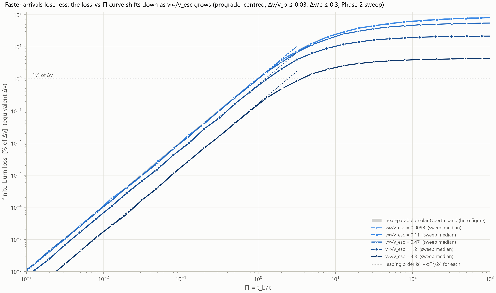

*I plot the median finite-burn loss from the sweep against Π for five arrival speeds, for prograde
burns centred on periapsis with Δv/v_p ≤ 0.03 and Δv/c ≤ 0.3. The dashed lines are the leading-order
law k(1−k)Π²/24 for each, and the grey band is the near-parabolic band of the hero figure.*

- **What it shows.** Faster arrivals lose less. The loss reaches 1% of Δv at Π = 0.99 for
  v∞/v_esc = 0.0098, 1.31 for 1.25 and 3.64 for 3.28. At Π = 10 the median loss is 24% for the
  slowest arrival and 2.2% for the fastest. Each curve follows its dashed law at small Π.

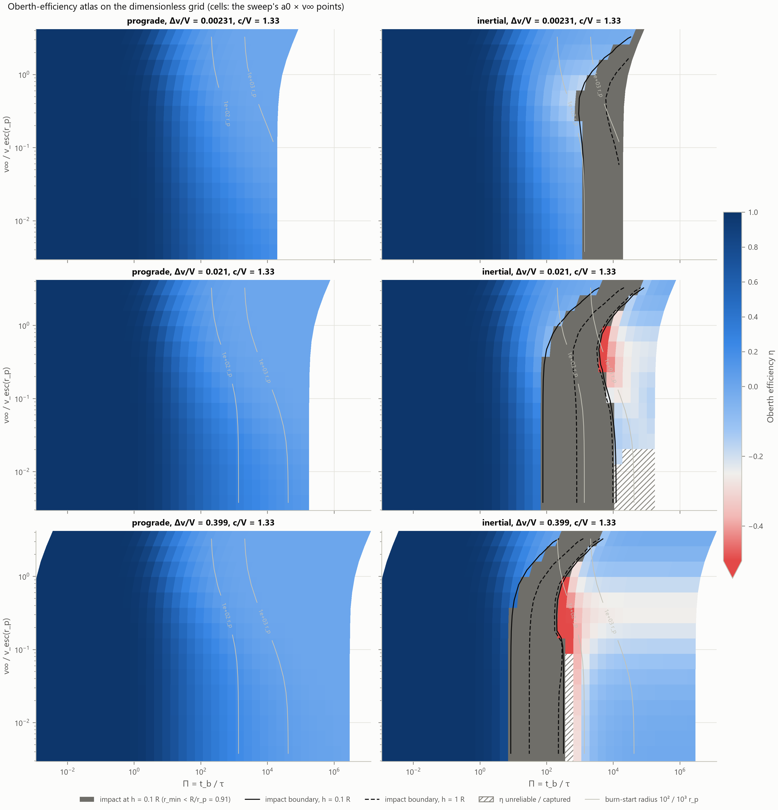

*I tile the dimensionless plane (Π, v∞/v_esc) with η from the sweep, for three Δv/V values (rows)
and for prograde (left) and inertial (right) steering. Colour is η. The light grey contours mark the
radius where the burn starts, 10² and 10³ r_p.*

- **How to read it.** Dark blue is η ≈ 1. Red is η < 0. In the inertial panels, grey cells are
  trajectories that dip below 0.1 R altitude (a planet of radius R is assumed), the solid and
  dashed black lines are the impact boundaries for h = 0.1 R and h = 1 R, and hatching marks cells
  where η is unreliable or the spacecraft is captured.
- **What it shows.** The prograde atlas is smooth and monotonic in Π. The inertial atlas is cut by
  an impact wedge at large Π and contains a red region of negative η. That is the same fixed-direction
  failure seen above, here as a map.

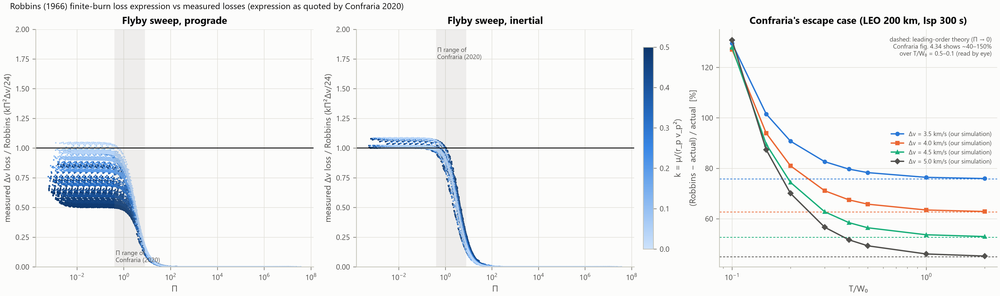

*I compare the Robbins<sup>2</sup> loss expression, as quoted by Confraria<sup>4</sup>, with the measured
loss. The left and middle panels show measured loss over kΠ²Δv/24 for the flyby sweep. The right panel
reproduces Confraria's escape case: the relative overestimate of Robbins' expression against
thrust-to-weight T/W₀.*

- **What it shows.** For fixed-direction thrust the ratio is 1.0–1.08 at small Π, so the expression
  equals the leading-order loss derived here (claim P1). For prograde thrust the ratio is 0.5–1.05
  and falls with k. The grey band is the Π range Confraria studied. In the escape case I reproduce a
  large overestimate of 130% at T/W₀ = 0.1 (Δv = 3.5 km/s), falling toward the leading-order
  asymptote at high thrust. The match is good at T/W₀ = 0.1 and an unresolved gap remains at 0.5
  (claim P5 in the outline).

### Mission samples: where real engines sit

The mission sample draws 256 scrambled-Sobol points inside each of the 6 body × 5 engine envelopes
(log-uniform in r_p, v∞, Δv, Isp and a₀) and simulates them with the real body for both steering
laws: 15,360 runs, no errors. The envelopes are **representative assumptions**, not hardware
specifications ([`configs/atlas/presets.yaml`](configs/atlas/presets.yaml)).

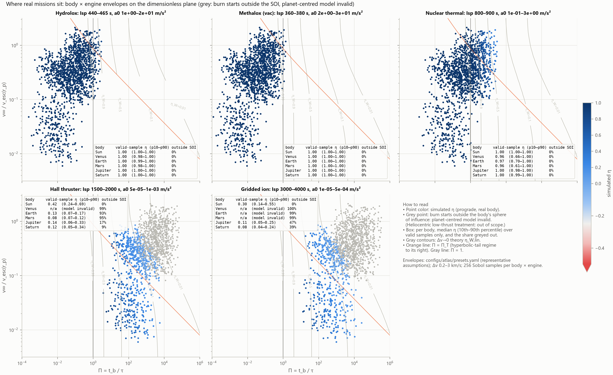

*I place the mission samples on the (Π, v∞/v_esc) plane, one panel per engine class. Colour is the
simulated η (prograde, real body). Grey points start burning outside the body's sphere of influence,
where the planet-centred model does not apply. Grey contours are the Δv → 0 η_W theory; the orange
line is Π = Π_T.*

Median η (10th–90th percentile) over valid prograde samples; the full table is
[`figures/mission_table.csv`](figures/mission_table.csv). "Valid" means η is defined and the burn
starts inside the sphere of influence; where fewer than all 256 samples are valid, the count is shown.

| body | Hydrolox | Methalox | Nuclear thermal | Hall | Gridded ion |
|---|---|---|---|---|---|
| Sun | 1.0000 (1.000–1.000) | 1.0000 (1.000–1.000) | 1.0000 (0.999–1.000) | 0.4198 (0.239–0.685) | 0.2995 (0.136–0.550) |
| Venus | 0.9990 (0.984–1.000) | 0.9998 (0.996–1.000) | 0.9592 (0.663–0.998) | n/a (0/256 valid) | n/a (0/256 valid) |
| Earth | 0.9992 (0.987–1.000) | 0.9998 (0.997–1.000) | 0.9677 (0.700–0.999) | 0.1322 (0.069–0.167) [18/256 valid] | n/a (0/256 valid) |
| Mars | 0.9990 (0.980–1.000) | 0.9997 (0.995–1.000) | 0.9553 (0.615–0.998) | 0.0784 (0.069–0.117) [13/256 valid] | n/a (0/256 valid) |
| Jupiter | 1.0000 (1.000–1.000) | 1.0000 (1.000–1.000) | 0.9995 (0.978–1.000) | 0.1387 (0.058–0.329) [213/256 valid] | 0.1062 (0.051–0.251) [135/256 valid] |
| Saturn | 1.0000 (1.000–1.000) | 1.0000 (1.000–1.000) | 0.9997 (0.989–1.000) | 0.1178 (0.046–0.336) [233/256 valid] | 0.0848 (0.039–0.235) [156/256 valid] |

- **What it shows.**
  - **Chemical** burns sit at Π ≲ 1 and are effectively impulsive.
  - **Nuclear thermal** burns reach Π ~ 1 at the terrestrial planets and lose a few percent
    there.
  - **Electric** burns sit at Π ~ 10²–10⁴ and keep a few to a few tens of percent. At Venus,
    Earth and Mars most Hall and ion samples would start burning outside the sphere of influence,
    so the planet-centred model is invalid. They are left blank, not given a number.

### Can a smarter burn win it back? (Phase 3)

The optimizer ([`optimize.py`](src/oberth_atlas/optimize.py)) searches for the best prograde-family
burn under a minimum-altitude constraint: *timing only* (the burn offset δ) or *full* (a linear
pitch law α₀ + α₁s plus δ). The campaign is 450 optimizations on a controlled grid, cross-checked
against Nelder–Mead (12 cases, agreement to 4.6e-9). The headline figure is the realistic mission
sample; the controlled grid explains the mechanism. Gains are quoted in pp of η against the
impulsive burn at the *nominal* periapsis. A second baseline, the impulsive burn at the trajectory's
own achieved periapsis, separates "burning efficiently" from "burning deeper".

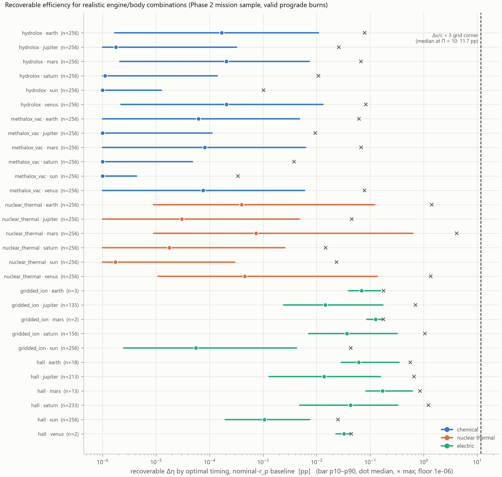

*I optimize the timing of every valid prograde burn in the Phase 2 mission sample and plot the
recoverable gain in η for each body and engine. The bar is the 10th–90th percentile, the dot is the
median, and the cross is the maximum. The dashed line marks the median at the unrealistic
Δv/c = 3 grid corner for comparison.*

- **What it shows.** Over 5,895 valid samples the median gain is 7e-6 pp for chemical engines
  (maximum 0.083), 8e-5 pp for nuclear thermal (maximum 4.1) and 0.0068 pp for electric (maximum
  1.2), against a median of 11.7 pp at Π = 10 in the Δv/c = 3 corner. Only 322 samples gain more
  than 0.1 pp, and in every one of them the optimum starts the burn *later*, not earlier. The gain
  tracks how far the centred burn lifts periapsis (Spearman 0.91). For realistic engines the
  centred prograde burn is already close to optimal.

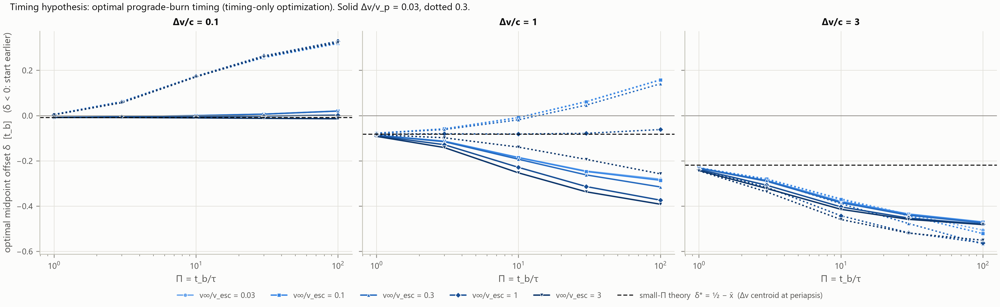

*I plot the optimal midpoint offset δ (in units of t_b; negative means starting earlier) against Π for
three mass-loading values Δv/c. The dashed line is the small-Π optimum δ* = ½ − x̄ and the dotted
line is the half-Δv rule.*

- **How to read it.** x̄ is the centroid of the Δv distribution. The small-Π theory puts that
  centroid, not the time midpoint, at periapsis. The half-Δv rule puts the *median* Δv point
  there instead.
- **What it shows.** At Π = 1 the simulated optima lie near the centroid line: δ* = −0.0083, −0.082
  and −0.219 at Δv/c = 0.1, 1 and 3. At larger Π they leave it. The half-Δv rule captures 75% of
  the small-Π gain as Δv/c → 0, and 76% and 80% at Δv/c = 1 and 3.

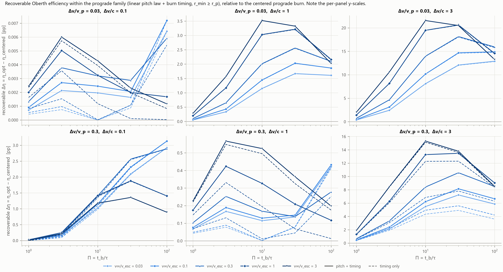

*I plot the recoverable gain in η against Π on the controlled grid, for two Δv/v_p values (rows) and
three Δv/c values (columns). Solid lines are pitch plus timing, dashed lines are timing only, and
colour is v∞/v_esc. Note the per-panel y-scales.*

- **What it shows.** Gains are small for light burns (up to 0.007 pp at Δv/c = 0.1 and Δv/v_p =
  0.03) and large only for the heavy corner (up to about 21 pp at Δv/c = 3). Timing alone
  accounts for a median 74%, 99% and 99% of the full pitch-plus-timing gain at Δv/c = 0.1, 1 and 3.

<details>
<summary>More Phase 3 figures: recovered fraction, pitch law, baselines, reversal</summary>

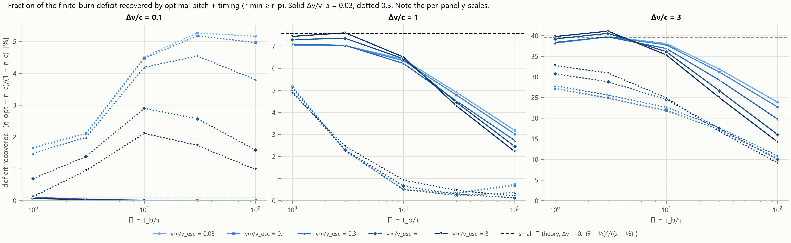

*I plot the share of the finite-burn deficit 1 − η recovered by optimal pitch plus timing. The dashed
line is the small-Π theory limit, 0.083%, 7.6% and 39.7% at Δv/c = 0.1, 1 and 3.*

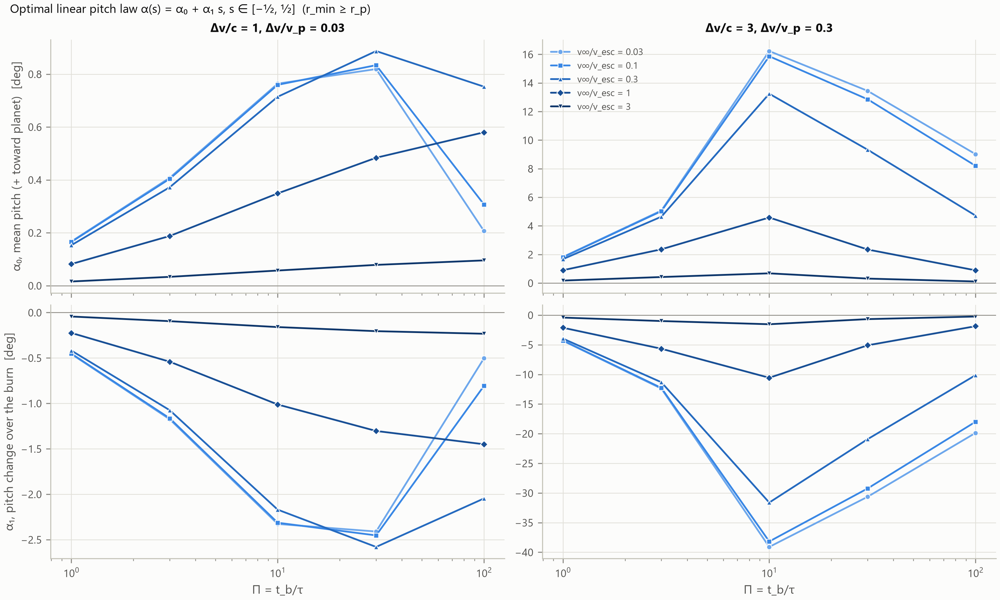

*I plot the optimal linear pitch law α(s) = α₀ + α₁s. Over the full grid the mean pitch α₀ has a
median of 0.58° (maximum 16.2°) and the pitch change α₁ a median of −1.6° (minimum −39.1°). The
optimal pitch tilts thrust slightly toward the planet.*

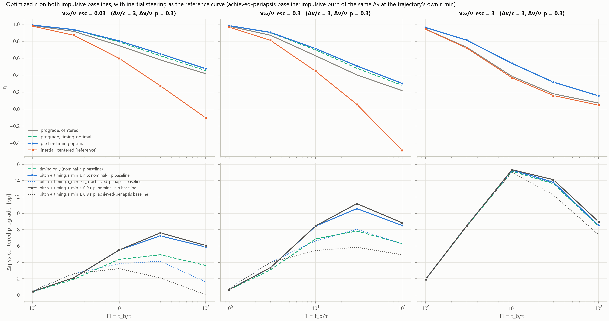

*I compare η on both impulsive baselines at Δv/c = 3 and Δv/v_p = 0.3 for three arrival speeds. The
top row shows η for centred prograde, timing-optimal, pitch-plus-timing optimal and, as a reference,
centred inertial steering. The bottom row shows the gain over centred prograde.*

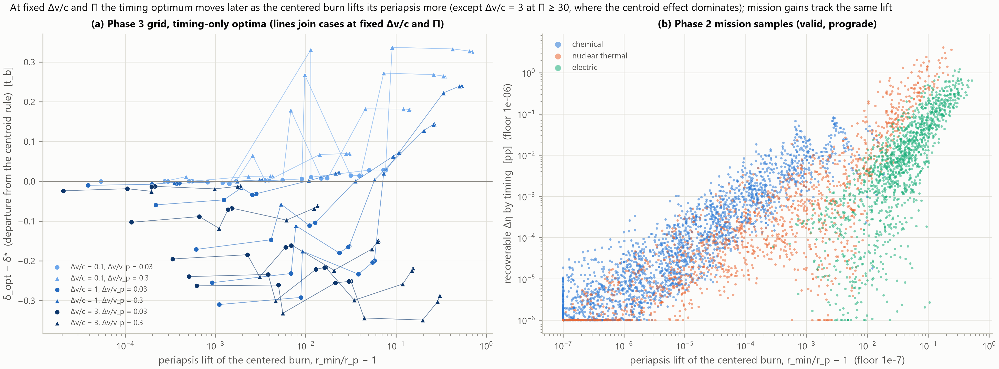

*I plot (a) the departure of the optimal offset from the centroid rule against the periapsis lift of
the centred burn, on the controlled grid, and (b) the recoverable gain against the same lift for the
mission samples. The departure and the lift are positively correlated within each (Δv/c, Π) set
(median Spearman 0.83). At Δv/c = 3 and large Π the centroid effect dominates and the sign
flips.*

Follow-up checks, from the committed outputs: a six-knot piecewise pitch adds at most 0.077 pp over
the linear law (median 0.003 pp); the placement rules are in `results/opt_phase3_rules.parquet`.

</details>

### Case study: a solar Oberth burn as a finite burn (Phase 4)

Hibberd et al.<sup>1</sup> propose a solar Oberth manoeuvre at 3.2 R☉ to catch the interstellar
object 3I/ATLAS, with Δv = 8.36 km/s from a CASTOR 30B + STAR 48B stack<sup>9</sup> on a bound arrival
from 5.2 au. They treat the burn as impulsive. [`staged.py`](src/oberth_atlas/staged.py) flies the
actual two-stage burn through perihelion, with motor data from
[`configs/phase4/hibberd_som.yaml`](configs/phase4/hibberd_som.yaml). The metric is the equivalent-Δv
loss, because a bound arrival has no η.

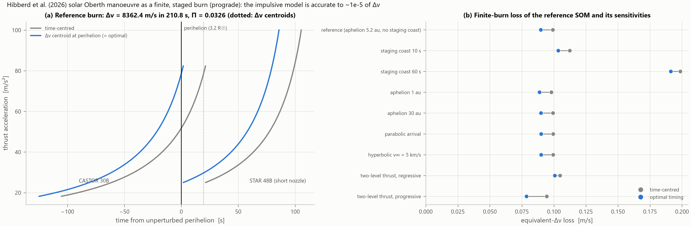

*I fly the two-stage burn of Hibberd et al.<sup>1</sup> through perihelion with catalog burn times.
Panel (a) shows the thrust acceleration against time for the burn centred in time (grey) and with its
Δv centroid at perihelion (blue, the optimum). Panel (b) shows the equivalent-Δv loss for the
reference burn and for each sensitivity I tested.*

- **What it shows.** The 8,362 m/s burn lasts 210.8 s, so Π = 0.0326. The loss is 0.099 m/s
  centred in time (1.2e-5 of Δv) and 0.090 m/s at the optimal timing. It stays below 0.2 m/s
  under every sensitivity; the largest is a 60-s coast between stages (0.199 m/s). The impulsive
  model holds for this burn.
- **Note on the inputs.** The 17,754 kg total listed in Table 2 of Hibberd et al.<sup>1</sup> could not
  be reconciled with the stage masses plus payload. The results use the stage sum (16,653.6 kg),
  which reproduces their Δv.

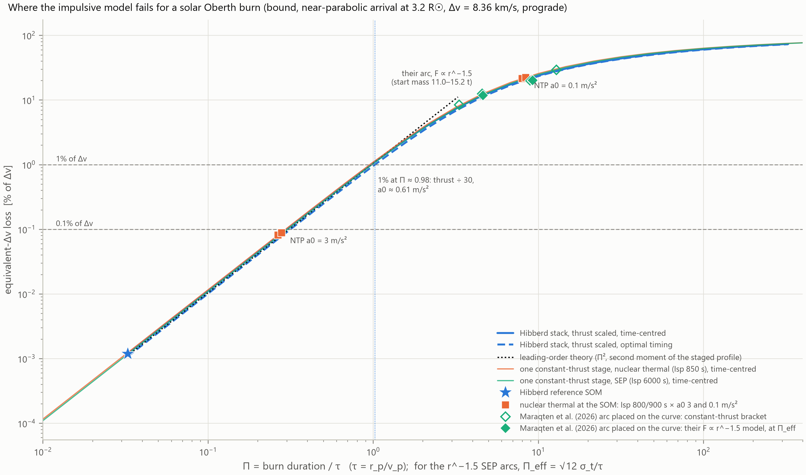

*I scale the thrust of the Hibberd stack and plot its loss against Π, together with a single
constant-thrust nuclear-thermal stage, a single solar-electric stage and the leading-order theory.
The star is the reference burn, the squares are nuclear-thermal burns at a₀ = 3 and 0.1 m/s², and the
diamonds place the arc of Maraqten et al.<sup>6</sup> on the curve.*

- **What it shows.** The three stage types lie within 8% of each other from Π = 0.1 to 100. The
  loss reaches 0.1% of Δv at Π ≈ 0.30 (thrust ÷ 9.2) and 1% at Π ≈ 0.98 (thrust ÷ 30, a₀ ≈
  0.61 m/s²). A single nuclear-thermal stage reaches 1% at a₀ ≈ 0.83–0.88 m/s². Maraqten et al.'s
  solar-electric arc, which never assumed an impulsive burn, sits at Π_eff ≈ 4.6–9.2, where the
  curve gives about 12–20%.

### One curve for all burns (Phase 5)

The hero figure at the top of this page is the Phase 5 result: the loss of a near-parabolic solar
Oberth burn depends on Π, not on the thrust profile. Over Π = 0.01 to 100 the curves for different
thrust profiles stay within 7.4% of one another. The Hibberd stack sits 6.7% above the simple
Π²/96 rule; the research log attributes the excess to the mass-ratio factor of the closed-form
bound (entry "Phase 5 checks").

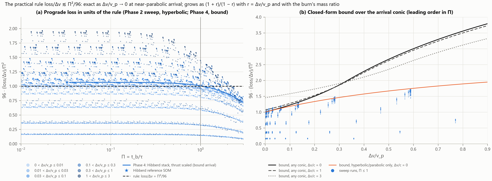

*I test the practical rule. Panel (a) plots 96·(loss/Δv)/Π² against Π for every prograde sweep run,
coloured by Δv/v_p, with the Phase 4 stack as a solid line. Panel (b) plots the closed-form
leading-order bound over the arrival conic against Δv/v_p, for Δv/c = 0, 1 and 3, with the
sweep runs with Π ≤ 1.*

- **How to read it.** Panel (a) is flat at 1 where the rule Π²/96 holds exactly.
- **What it shows.** The rule loss/Δv ≲ Π²/96 is a leading-order bound at small Δv/v_p. In general
  the bound over any arrival conic is (1 + r)/(96(1 − r)) times a mass-ratio factor, with
  r = Δv/v_p; it is 1.02 × Π²/96 at r = 0.01 and 1.22 × Π²/96 at r = 0.1. Of the prograde sweep
  runs with Π ≤ 1 whose loss is resolved to 1% (20,860), every one lies within 1.010 of the bound for
  its own Δv/v_p and Δv/c.
- **Conditions.** The rule holds for prograde steering, a burn centred on periapsis, Π ≲ 1, and small
  Δv/v_p and Δv/c: to within about 10% for Δv/v_p ≲ 0.03 and Δv/c ≲ 1. It does not apply to
  fixed-direction thrust. Under these conditions, a burn shorter than r_p/v_p is impulsive to about
  1% of Δv.

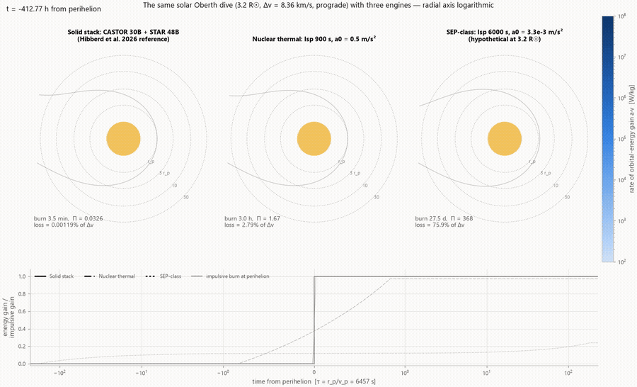

*I fly the same solar Oberth dive (3.2 R☉, Δv = 8.36 km/s, prograde) with three engines: the Hibberd
solid stack (Π = 0.0326), a nuclear-thermal engine (Isp 900 s, a₀ = 0.5 m/s², Π = 1.67) and a
hypothetical SEP-class engine at the same distance (Isp 6000 s, a₀ = 3.3e-3 m/s², Π = 368). The
radial axis is logarithmic and the lower panel shows the energy gained as a fraction of the impulsive
gain.* [MP4](figures/anim_engines.mp4) · [final frame](figures/anim_engines_final.png)

The solid stack burns for 3.5 min and loses 0.00119% of Δv. The nuclear-thermal engine burns for
3.0 h and loses 2.79%. The SEP-class engine burns for 27.5 days and loses 75.9%, gaining only 24% of
the impulsive energy, within 5% of the parabolic-core law (9/(2Π))^(1/3) = 0.23.

**Interactive explorer.** [`explorer/oberth_explorer.html`](explorer/oberth_explorer.html) is a
single self-contained page. Download it and open it in a browser; it needs no server. Choose a body,
periapsis, v∞, Δv and engine (or, in dimensionless mode, Π, v∞/v_esc, Δv/v_p and Δv/c), and it
simulates the flyby live. It shows η, the loss, Π and the closest approach, with the trajectory, the
position on the universal loss curve, and the η atlas. One example case approximates the Hibberd et
al. burn. Its JavaScript simulator is a port of `simulate_nd`, tested against Python in
`tests/test_explorer_js.py` (skipped without Node.js). It handles hyperbolic arrivals only.

<details>
<summary>All figures and the scripts that make them</summary>

| figure | script | what it is |
|---|---|---|
| `trajectory_earth_hydrolox.png`, `trajectory_jupiter_hall.png`, `trajectory_earth_pitch_example.png`, `trajectory_jupiter_nuclear_thermal.png` | `fig_example_trajectories.py` | the four example configs in `configs/` |
| `eta_vs_a0.png` (+ `.csv`) | `fig_eta_vs_a0.py` | impulsive-limit convergence |
| `eta_vs_pi_all.png` | `fig_eta_vs_pi.py` | η against Π for the whole sweep |
| `prefactor_check.png` | `fig_prefactor_check.py` | small-Π prefactor against the sweep |
| `collapse_small_pi.png`, `collapse_secondary.png`, `collapse_metrics.csv` | `fig_collapse.py` | collapse on Π and Π√C, secondary parameters |
| `regimes.png`, `regimes_half_point.csv` | `fig_regimes.py` | three regimes and the half-efficiency point |
| `atlas_eta.png` | `fig_atlas.py` | η atlas on the dimensionless plane |
| `missions_regions.png`, `mission_table.csv` | `fig_missions.py` | where real engines sit |
| `robbins_comparison.png`, `.csv` | `robbins_comparison.py` | Robbins' expression against the data |
| `phase3_*.png`, `phase3_mission_table.csv` | `fig_phase3.py` | optimization results |
| `phase4_reference.png`, `phase4_loss_vs_pi.png` | `fig_phase4.py` | the Hibberd case study |
| `rule_check.png` | `rule_check.py` | the Π²/96 rule |
| `hero_loss_vs_pi.png`, `.pdf` | `fig_hero.py` | the hero figure |
| `loss_vs_pi_vinf.png` | `fig_loss_vinf.py` | arrival-speed dependence |
| `anim_engines.{mp4,gif}`, `anim_engines_final.png` | `anim_engines.py` | engine animation |
| `confraria_fig434_digitized.csv` | `digitize_confraria.py` | digitized literature data (an input, not a result) |

</details>

## Data

Everything is committed, so you can inspect results without rerunning anything.

| file | what it holds |
|---|---|
| `results/sweep_nd.parquet` | the 135,720-run body-free sweep |
| `results/missions.parquet` | the 15,360 mission samples (6 bodies × 5 engines × 256 samples × 2 steering laws) |
| `results/opt_phase3.parquet` | the 450 optimizations |
| `results/opt_phase3_crosscheck.csv` | the Nelder–Mead cross-check (12 cases) |
| `results/opt_phase3_rules.parquet`, `opt_phase3_piecewise.parquet`, `opt_missions.parquet` | Phase 3 follow-ups: placement rules, six-knot pitch, optimal timing for the mission samples |
| `results/phase4.parquet` | the staged-burn runs of Phase 4 |
| `figures/*_numbers.json` | the numbers behind each phase's figures and the paper outline |
| `figures/*.csv` | the table behind individual figures |

Key sweep columns: the four groups `v_inf`, `dv`, `c`, `a0` and `steering`; the derived `v_p`, `k`,
`v_inf_over_vesc`, `dv_over_vp`, `dv_over_c`, `xi`, `Pi_T`; the results `status`, `Pi`, `eta`,
`eta_err`, `eta_W`, `eta_E`, `v_inf_out`, `b_imp`, `b_finite`, `r_min`; the quality flags
`hit_floor`, `captured`, `b_imp_small`, `eta_unreliable`; and the theory columns `C_theory`,
`eta_lin`, `eta_W_lin`. The mission files add `body`, `engine`, the SI inputs and the sphere-of-influence
ratios. Parquet files carry provenance (grid or sampling spec, numerics, git revision, package
versions) in their metadata.

```python
import pandas as pd
from oberth_atlas.analysis import reliable
from oberth_atlas.sweep import read_metadata

df = pd.read_parquet("results/sweep_nd.parquet")
pro = df[reliable(df) & (df["steering"] == "prograde")]
print(pro[["v_inf_over_vesc", "dv_over_vp", "Pi", "eta"]].describe())
print(read_metadata("results/sweep_nd.parquet"))      # provenance
```

## Getting started

```bash
python -m venv .venv
.venv/Scripts/python -m pip install -e ".[dev]"     # .venv/bin/python on macOS/Linux
.venv/Scripts/python -m pytest                      # full suite
```

Python 3.11 or later is required; the audited environment is Python 3.13.

### Simulate one flyby

```bash
.venv/Scripts/oberth run configs/earth_hydrolox.yaml          # or: python -m oberth_atlas run ...
.venv/Scripts/oberth run configs/jupiter_hall.yaml --no-plot
```

`oberth run` prints the metrics and writes `runs/<name>/result.json` (SI units) and
`runs/<name>/trajectory.png`. A config looks like this; unknown keys are rejected, and the full
schema is documented in `src/oberth_atlas/config.py`.

```yaml
body: earth                  # sun | venus | earth | mars | jupiter | saturn
flyby:
  v_inf_in_km_s: 3.0
  periapsis_altitude_km: 300.0
engine:
  isp_s: 465.0
  a0_m_s2: 2.0               # or thrust_N together with m0_kg
burn:
  delta_v_km_s: 1.0
  midpoint_offset_s: 0.0     # or midpoint_offset_tau / midpoint_offset_tb
steering:
  law: prograde              # prograde | inertial | pitch_linear | pitch_piecewise
safety_margin_km: 100.0
```

### Use the library

```python
from oberth_atlas.burn import BurnSpec, Engine
from oberth_atlas.constants import get_body
from oberth_atlas.simulate import simulate_flyby
from oberth_atlas.steering import Prograde

res = simulate_flyby(
    get_body("earth"), v_inf_in=3_000.0, periapsis_altitude=300_000.0,
    burn=BurnSpec(delta_v=1_000.0, engine=Engine(isp=465.0, a0=2.0)),
    steering=Prograde(),
)
print(res.Pi, res.eta, res.delta_v_loss)
```

The public API is in SI. For sweeps use `simulate_nd` (nondimensional, body-free); for bound
arrivals and staged burns use `staged.simulate_staged_nd`; for optimization use
`optimize.optimize_case`.

### Regenerate results and figures

```bash
# Phase 1: single flybys
.venv/Scripts/python scripts/fig_eta_vs_a0.py                   # -> figures/eta_vs_a0.{png,csv}
.venv/Scripts/python scripts/fig_example_trajectories.py        # -> figures/trajectory_<config>.png

# Phase 2: sweep and atlas
.venv/Scripts/oberth sweep --out results/sweep_nd.parquet       # ~136k runs, ~25 min on 8 cores
.venv/Scripts/oberth missions --n 256 --out results/missions.parquet
.venv/Scripts/python scripts/fig_regimes.py                     # also writes regimes_half_point.csv
.venv/Scripts/python scripts/fig_missions.py                    # also writes mission_table.csv
.venv/Scripts/python scripts/fig_prefactor_check.py
.venv/Scripts/python scripts/fig_eta_vs_pi.py
.venv/Scripts/python scripts/fig_collapse.py
.venv/Scripts/python scripts/fig_atlas.py
.venv/Scripts/python scripts/phase2_numbers.py                  # -> figures/phase2_numbers.json

# Phase 3: optimization
.venv/Scripts/python scripts/run_phase3.py                      # ~25 min on 8 cores
.venv/Scripts/python scripts/run_phase3_followups.py            # placement rules, missions, 6-knot pitch
.venv/Scripts/python scripts/fig_phase3.py

# Phase 4: solar Oberth case study
.venv/Scripts/python scripts/run_phase4.py                      # ~2 min
.venv/Scripts/python scripts/fig_phase4.py

# Phase 5: checks and deliverables
.venv/Scripts/python scripts/rule_check.py
.venv/Scripts/python scripts/fig_hero.py
.venv/Scripts/python scripts/anim_engines.py                    # needs ".[anim]" for the bundled ffmpeg
.venv/Scripts/python scripts/build_explorer.py

# Wrap-up: comparisons and sensitivity checks
.venv/Scripts/python scripts/robbins_comparison.py
.venv/Scripts/python scripts/j2_sensitivity.py
.venv/Scripts/python scripts/fig_loss_vinf.py
```

`scripts/rebuild_all.py` runs every step in dependency order (`--list` prints them). The full
commands, with their outputs, are in [`CLAUDE.md`](CLAUDE.md).

To check a Markdown draft against the project's numbers, run
`scripts/check_numbers.py draft.md`: it flags every number that matches no value in the
`figures/*_numbers.json` files.

## Reproducibility and validation

- **One command rebuilds everything**: `scripts/rebuild_all.py` runs the tests, the sweep, the
  optimization, every figure, the animation, the numbers files and the explorer in dependency order.
  It takes about 43–79 min on the audit machine (8 cores). See [`docs/repro.md`](docs/repro.md).
- **Exact environment**: [`requirements-lock.txt`](requirements-lock.txt) pins the 24 audited
  package versions.
- **Audit**: at the `v1.0-analysis` tag, a fresh clone rebuilt all outputs and
  `scripts/repro_audit.py` found **56 of 56 outputs identical** to the committed ones, ignoring
  provenance stamps and wall-clock fields. The audit also found, and fixed, outputs that had gone
  stale after code changes, and one bug in the animation script.
- **Tests**: 509 tests at the last audit (`pytest`). They cover:
  - coast invariants and the Kepler solver;
  - the gravity-free closed form for the burn;
  - mass, frame and body independence;
  - convergence to the impulsive limit at second order;
  - the small-Π theory at any apse against direct integration;
  - the optimizer, the staged simulator and the J2 model;
  - the explorer's JavaScript simulator against Python.
- **Accuracy**: in the sweep, the coast energy drift has a median of 3.5e-13 (normalized by v_p²/2).
  The per-run error estimate on η has a median of 1.6e-10 and a maximum of 3.8e-7, below the 1e-6
  reliability flag everywhere.
- **No hand-tuned numbers.** By project rule, every number and figure comes from code in this
  repository. If a test tolerance changes, the measured floor that justifies it is logged in
  `RESEARCH_LOG.md`.

## Repository layout

<details>
<summary>Directory tree</summary>

```
src/oberth_atlas/   the library
    constants.py        GM, radii, semi-major axes, g0, each with a source comment
    units.py            nondimensional scales
    kepler.py           hyperbolic Kepler solver
    dynamics.py         equations of motion
    burn.py             Engine and BurnSpec
    steering.py         prograde, inertial, pitch laws
    simulate.py         simulate_nd (body-free core) and simulate_flyby (SI wrapper)
    metrics.py          η, η_W, η_E, bonus and loss formulas
    theory.py           closed-form theory (small Π, regimes, optimal timing)
    sweep.py, presets.py, analysis.py    sweeps, engine/body envelopes, reliability masks
    optimize.py         timing and pitch optimization
    staged.py           multi-stage burns about any arrival conic
    j2.py               oblateness sensitivity
    config.py, cli.py   YAML/JSON configs and the `oberth` command
    plotting.py         validated palette and figure saving
tests/              pytest suite
configs/            single-flyby examples, atlas presets, Phase 4 motor data
scripts/            one script per figure, plus run_*, rebuild_all, repro_audit, check_numbers
figures/            committed 300-dpi PNGs, CSVs and *_numbers.json
results/            committed Parquet and CSV result tables
explorer/           the interactive page (edit template, css and js, not the built HTML)
docs/               theory, paper outline, reproducibility, AI-use log
```

</details>

## Limitations

- **Gravity.** Point-mass gravity. A J2 check on 10 cases at 1.1 R (Jupiter and Saturn, Π = 0.1–100)
  changes η by at most 0.0026, at most 4.9% of the deficit 1 − η. Absolute outgoing speeds shift by
  21–28 m/s.
- **Frame.** The planet-centred model is invalid for burns that start outside the sphere of
  influence. Those samples are masked, not assigned a number.
- **Arrivals.** The atlas uses hyperbolic arrivals. The case study uses a bound one.
- **Case study.** Planar point-mass Sun. Constant thrust per motor (bracketed by two-level profiles);
  the staging coast is unknown (bracketed by 10 s and 60 s); thermal limits are not modelled. The
  solar-electric engine at 3.2 R☉ in the animation is hypothetical.
- **Steering.** Only smooth pitch laws and one piecewise law were tested, so the optima are optima
  within those families.
- **Presets.** Engine and body envelopes are representative assumptions, not hardware data. The
  mission statistics depend on them.

## Status of the claims and prior work

The project is in a **feature freeze** at tag `v1.0-analysis` (2026-10-06). The only planned
follow-ups are those that depend on obtaining Robbins' 1966 paper.

| phase | scope | state |
|---|---|---|
| 1 | simulator core, validation, CLI | complete |
| 2 | sweep, theory, collapse, atlas | complete |
| 3 | burn optimization | complete |
| 4 | solar Oberth case study | complete |
| 5 | rule check, hero figure, animation, explorer | complete |
| wrap-up | J2 sensitivity, arrival-speed figure, reproducibility audit | complete |

**What is established and what is not.**
- The simulator, the sweep and the numerical results are validated by the test suite and the
  reproducibility audit (see above).
- The leading-order scaling (ω t_b)²Δv/24 is attributed to Robbins<sup>2</sup>, taken as quoted by
  Confraria<sup>4</sup>. The original paper could not be accessed. The nondimensionalization follows
  Willis<sup>3</sup>. Other related work includes continuous-thrust close approaches<sup>5</sup> and
  solar-electric Oberth maneuvers<sup>6</sup>; the full review is in `RELATED_WORK.md`.
- The claims that go beyond that are provisional until Robbins is read: the exact prograde prefactor
  and its relation to Robbins' expression, the large-Π regimes (related asymptotics for spiral escape
  are classical<sup>7,8</sup>), the optimal-timing closed form, and the practical rule, which is
  probably close to practitioner heuristics and is not claimed as a discovery. The register of
  claims, what each depends on and what would settle it is in
  [`docs/paper_outline.md`](docs/paper_outline.md).
- A paper outline is in `docs/paper_outline.md`; there is no paper yet. Until there is one, cite the
  repository at the `v1.0-analysis` tag.

## Documentation

| file | contents |
|---|---|
| [`docs/theory.md`](docs/theory.md) | the analytic theory: energy bookkeeping, linear response, small-Π expansion, regimes, optimal timing |
| [`RESEARCH_LOG.md`](RESEARCH_LOG.md) | dated log of every decision, assumption, sourced parameter and surprising result |
| [`RELATED_WORK.md`](RELATED_WORK.md) | literature review and the contribution statement |
| [`docs/paper_outline.md`](docs/paper_outline.md) | the paper outline and the claim register |
| [`docs/repro.md`](docs/repro.md) | rebuild instructions, the audit, runtimes and hardware |
| [`docs/ai_use_log.md`](docs/ai_use_log.md) | per phase, what the AI assistant implemented, derived or found, and what the author decided |
| [`CLAUDE.md`](CLAUDE.md) | project conventions: units, frames, working rules, commands |

## References

1. A. Hibberd, T. M. Eubanks, A. M. Hein, "Catching 3I/ATLAS Using a Solar Oberth,"
   arXiv:2601.02533 v2 (2026).
2. H. M. Robbins, "An analytical study of the impulsive approximation," *AIAA J.* 4(8):1417–1423
   (1966). doi:10.2514/3.3687.
3. E. A. Willis, Jr., "Finite-thrust escape from and capture into circular and elliptic orbits,"
   NASA TN D-3606 (1966).
4. J. C. F. Confraria, "Finite burn losses in spacecraft maneuvers revisited," MSc thesis,
   Instituto Superior Técnico, Lisbon (2020).
5. A. F. S. Ferreira et al., "Low Thrust Propelled Close Approach Maneuvers," *Symmetry*
   14(9):1786 (2022). doi:10.3390/sym14091786.
6. N. Maraqten, W. van Lynden, C. Gómez de Olea Ballester, A. M. Hein, "High-temperature
   photovoltaics for solar-electric Oberth maneuvers: ton-class payload feasibility for
   interstellar-precursor missions," arXiv:2608.11113 v1 (2026).
7. H. S. Tsien, "Take-off from satellite orbit," *J. Am. Rocket Soc.* (1953).
8. C. Bombardelli, G. Baù, J. Peláez, "Asymptotic solution for the two-body problem with constant
   tangential thrust acceleration," *Celest. Mech. Dyn. Astr.* (2011).
9. Northrop Grumman, *Propulsion Products Catalog*, OSR No. 16-S-1432 (2016).
10. JPL Solar System Dynamics, Astrodynamic Parameters (DE440) and Planetary Physical Parameters;
    IAU 2015 Resolution B3 (nominal solar radius). Constants and sources:
    `src/oberth_atlas/constants.py`.
